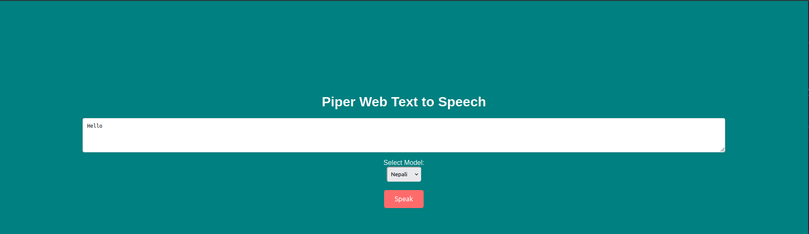

# Piper Text-to-Speech Web Interface

A Dockerized web interface for Piper TTS (Text-to-Speech) with support for multiple languages.

 *(Optional: Add screenshot later)*

## Features

- Web-based interface for Piper TTS
- Support for multiple language models
- Docker containerization for easy deployment
- Simple REST API for TTS functionality

## Prerequisites

- Docker
- Docker Compose
- Piper binary and model files

## Installation

1. Clone this repository:
   ```bash
   git clone https://github.com/Ted0011/docker-piper.git
   cd docker-piper

## Run the command in docker-piper directory

2. Running Docker command:
   ```bash
   docker-compose up --build -d

## The web interface will be available at: http://your_dynamic_IP:8080 

Note: Even your phone can browse the web application and give your laptop VOICE

## Now your computer makes noise of what you say....

<a href="https://ko-fi.com/Y8Y41APR1N" target="_blank"></a>
